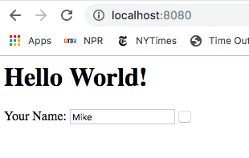
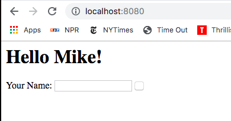

# ScalaWebApp
---------------------------

A simple Hello World App written in Scala using Scalatra

## Dependencies
----------------
1. <a href="https://maven.apache.org/">Maven 3.6.0</a>

2. <a href="https://www.oracle.com/technetwork/java/javase/downloads/jdk8-downloads-2133151.html">Java SE Development Kit 8</a>

3. <a href="http://scalatra.org/">Scalatra</a>

##  Using
------------
Run the following commands:

1. `mvn compile`

2. `mvn jetty:run`

Then in a web-browser go to http://localhost:8080 to see the page:

When you put in a name and click on the square results in:

